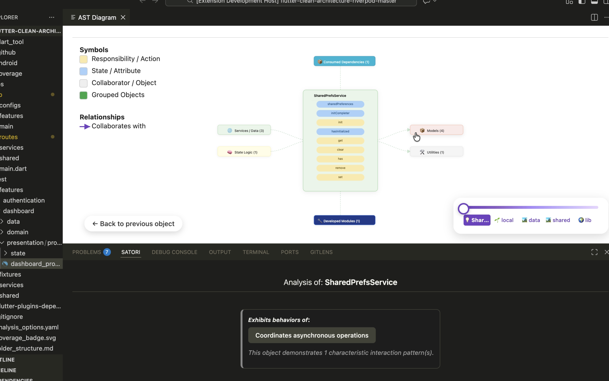

# Satori (Preview)

> ⚠️ **This extension is in active development. Functionality may change.**


**Interactive visualizer for Flutter/Dart projects**

Satori transforms your Flutter code into interactive diagrams, allowing you to explore relationships between classes, dependencies, data flow, and project structure with a modern visual interface.


## 🚀 Quick Start

1. **Install prerequisites**: Ensure Dart-Code extension is installed and active
2. **Open a Flutter/Dart project** in VS Code
3. **Wait for Dart analysis** to complete (status bar shows "Analysis complete")
4. **Press `Ctrl+Shift+P`** → "Satori: Analyze Current Project"
5. **Wait for analysis** to complete and view your diagram



## ✨ Main Features

### 🎯 **Automatic Architectural Analysis**
- **Layer classification**: View, State, Service, Model, Utility

### 🌐 **Interactive Visualization**

- **Overview View**: Navigation through architectural layers
- **Focus View**: Detailed exploration of classes and their members
- **List View**: Search and filtering by components
- **Folder navigation**: Hierarchical project exploration

### 🔗 **Relationship Analysis**

- **Inheritance**: `extends`, `implements`, `with`
- **Calls**: Methods and functions (local project only)
- **Dependencies**: Types and instantiation (limited to VS Code's built-in symbol analysis)
- **Data flow**: Basic detection using the Dart extension's capabilities

> **Note**: Current analysis focuses on structural relationships. Semantic analysis of internal responsibilities and decisions is in development.

### 📦 **Package Management**
- **External dependency analysis**: pub.dev, custom packages
- **Import visualization**: Relationships between project and packages
- **Automatic classification**: SDK, official, third-party, local

### 🛠️ **Advanced Features**
- **Smart navigation**: Click-to-code from diagram
- **Details panel**: Contextual information and collaborations
- **Navigation slider**: Exploration by abstraction levels

## 📋 Use Cases

- **Refactoring**: Identify dependencies before moving classes
- **Code Review**: Visualize architectural change impact
- **Onboarding**: Understand new project structure
- **Documentation**: Automatically generate architecture views

## 🚀 Installation

### From VS Code Marketplace

1. Open VS Code
2. Go to Extensions (`Ctrl+Shift+X`)
3. Search for "Satori"
4. Click "Install"

## ⚙️ Configuration

### Prerequisites

- **Dart extension**: Official Dart-Code extension must be installed and active
- **VS Code**: 1.74.0 or higher

### Initial Setup

```json
{
  "Satori.enableDebugLogs": false,
  "Satori.language": "en"
}
```

## 📖 Usage

### 1. **Overview View - Architectural Exploration**
```
Command: "Satori: Analyze Current Project"
Shortcut: Ctrl+Shift+P → Search "Analyze Current Project"
```

- Navigate through architectural layers (View, State, Service, Model)
- Each layer shows the number of components
- Click to see detailed list of each layer

### 2. **Focus View - Detailed Analysis**
- **From Overview**: Click on any component
- **From List**: Click on specific element
- **Direct navigation**: Click on relationships in details panel

**Focus View Features:**
- 🎯 **Central node**: The analyzed component with all its members
- ⬅️ **Predecessors**: Components that depend on the focus
- ➡️ **Successors**: Components that the focus depends on
- ⬆️ **External imports**: Dependencies on consumed packages
- ⬇️ **Developed imports**: Project's own modules

### 3. **Folder Navigation**

```
Navigation slider: Exploration by abstraction levels
💡 Specific → 🌱 Folder → 🏞️ Feature → 🌍 Project
```

### 4. **Details Panel**

- **Smart collaborations**: Natural language descriptions
- **Node clicks**: Quick navigation between components
- **Visual categorization**: UI, Logic, Data, Inheritance

## 🎨 Visual Interface

### Color Scheme by Layers

- 🔵 **View**: UI Components (Widgets, Screens)
- 🟡 **State**: State management (BLoC, Provider, Controller)
- 🟢 **Service**: Services and repositories (API, Database)
- 🟠 **Model**: Data models (DTOs, Entities)
- ⚪ **Utility**: Helpers and utilities

### Relationship Types

- 🟢 **Extends**: Class inheritance
- 🔵 **Implements**: Interface implementation
- 🟣 **Calls**: Method calls
- 🟠 **Reads From**: Data reading
- 🔴 **Writes To**: Data writing

## 🔧 Available Commands

| Command | Description |
|---------|-------------|
| `satori.analyzeProject` | Automatically analyze current project |
| `satori.showProjectDiagram` | Open project diagram |
| `satori.toggleDebugLogs` | Enable/disable debug logs |

## ⚠️ Known Limitations

> **Important**: This extension is in preview. Some functionality is under development.

- **Large projects**: Analysis may take time on projects with >1000 files
- **Complex generics**: Some generic type relationships may not be detected
- **Generated code**: `.g.dart` files are processed but may create noise
- **Semantic analysis**: Internal responsibilities and decisions are in development
- **External packages**: Analysis limited to main public symbols
- **Dart extension dependency**: Requires the official Dart extension to be installed and active
- **Symbol analysis**: Depends on the Dart extension's language server for symbol information

## 🛠️ Development and Contribution

### Environment Setup

```bash
# Clone repository
git clone https://github.com/your-repo/satori.git
cd Satori

# Install dependencies
npm install

# Compile TypeScript
npm run compile

# Run in development mode
F5 (from VS Code)
```

### Project Structure

```
src/
├── extension.ts              # Main entry point
├── ui/                       # User interface
│   ├── extension_lifecycle.ts
│   ├── webview_creator.ts
│   └── providers/
├── analysis/                 # Code analysis
│   ├── symbol_processor.ts
│   ├── symbol_transformer.ts
│   └── enrichment/
├── graph/                    # Graph construction
│   ├── graph_builder.ts
│   ├── node_creator.ts
│   └── edge_creator.ts
├── packages/                 # Package management
│   └── graph_integration/
├── lsp/                      # LSP integration
├── core/                     # Utilities and algorithms
└── types/                    # Type definitions
```

### Testing

```bash
# Run tests
npm test

# Test with coverage
npm run test:coverage
```

## 🛟 Troubleshooting

### Dart Extension Issues

1. Ensure the official Dart extension is installed and active
2. Verify the Dart extension can analyze your project files
3. Check that `dart pub get` has been run in the project

### Incomplete Analysis

1. Run `dart pub get` in the project
2. Restart VS Code
3. Enable debug logs: `satori.toggleDebugLogs`

### Performance Issues

- Close other large projects in VS Code
- Verify available memory (>4GB recommended)
- Consider modular analysis for very large projects

## 📄 License

Apache License 2.0 - See [LICENSE](LICENSE) for more details.

## 🤝 Contributing

Contributions are welcome! Please:

1. Fork the project
2. Create a feature branch (`git checkout -b feature/AmazingFeature`)
3. Commit your changes (`git commit -m 'Add some AmazingFeature'`)
4. Push to the branch (`git push origin feature/AmazingFeature`)
5. Open a Pull Request

### Roadmap

- [ ] Support for incremental analysis
- [ ] Diagram export (PNG, SVG)
- [ ] Integration with documentation tools
- [ ] Quality metrics analysis
- [ ] Support for other languages (Kotlin, Swift)
- [ ] Improved symbol analysis independent of external extensions
- [ ] Enhanced relationship detection

## 🙏 Acknowledgments

- Dart/Flutter team for the excellent Language Server Protocol
- VS Code community for development tools
- D3.js for visualization capabilities
- All contributors and beta users

---

**Problems or suggestions?**

- [GitHub Issues](https://github.com/gearscrafter/satori/issues)
- [Discussions](https://github.com/gearscrafter/satori/discussions)

**Give it a ⭐ if Satori helps you understand your Flutter code better!**