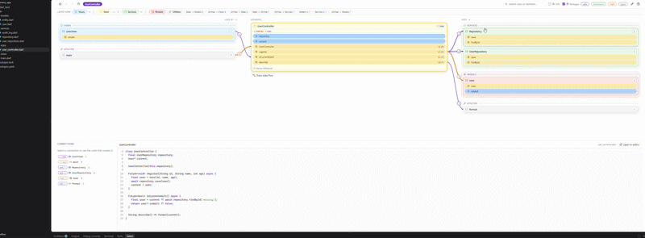
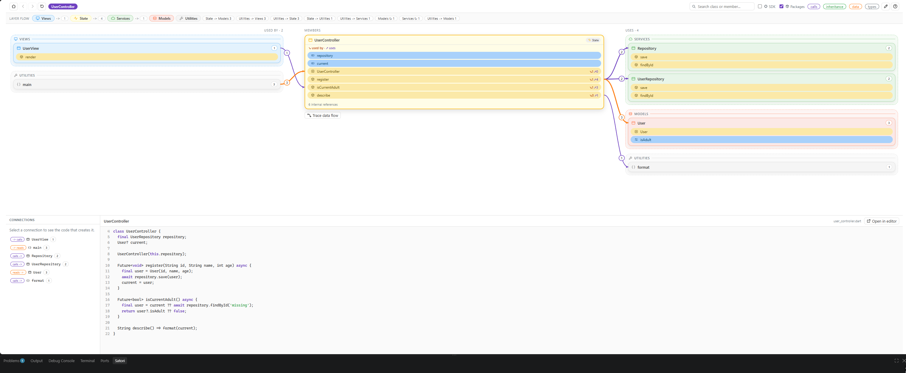

# Satori (Preview)

> ⚠️ **This extension is in active development. Functionality may change.**


**Interactive visualizer for Flutter/Dart projects**

Satori transforms your Flutter code into interactive diagrams, allowing you to explore relationships between classes, dependencies, data flow, and project structure with a modern visual interface.



## 🚀 Quick Start

1. **Install prerequisites**: Ensure Dart-Code extension is installed and active
2. **Open a Flutter/Dart project** in VS Code
3. **Wait for Dart analysis** to complete (status bar shows "Analysis complete")
4. **Press `Ctrl+Shift+P`** -> "Satori: Analyze Current Project"
5. **Wait for analysis** to complete and view your diagram



## ✨ Main Features

### 🎯 **Automatic Architectural Analysis**
- **Layer classification**: View, State, Service, Model, Utility

### 🌐 **Interactive Visualization**

- **Overview**: every class grouped in nested layer containers, busiest first
- **Focus view**: the selected class in the centre, with its members as pills; callers on the left, callees on the right
- **Nested boxes**: layer container -> class box -> member pills
- **Aggregated arrows**: one arrow per pair of classes with a counter; click it to read the exact code behind it
- **Layer flow bar**: how many references go from View -> State -> Service -> Model, with architecture violations flagged in red
- **Trail history**: back / forward buttons and breadcrumbs through the elements you visited
- **Smooth transitions**: boxes glide to their new place and new ones unfold from the centre
- **Move anything**: drag a box, or a whole layer, and the arrows follow
- **Audit and heat map**: the flame button paints every box from cool to red by risk (coupling, size, cycles and layer violations), the way hotspot maps do, and lists the circular dependencies, the layer violations and the hottest classes. Pick one factor to see it alone; click a name to open it. Folded containers take the heat of the hottest class inside
- **State management map**: a tag next to a class names the approach it uses (**Bloc / Cubit**, **ChangeNotifier** (Provider), **Riverpod** notifiers, **GetX** controllers), read from what the class extends. A pink "observes" arrow goes from a widget to the state holder it listens to (`BlocBuilder<X>`, `context.read<X>()` / `watch<X>()` / `select<X>()`, `Provider.of<X>`, `Get.find<X>`). The audit panel lists the approaches in use with how many classes listen to each holder, and warns when the project mixes more than one
- **Dependency column**: below the "uses" column, a vertical stack with what the focused class's file imports split into **Flutter**, **third-party packages** and the **Dart SDK**, with arrows from the class. Click an arrow to read the import lines, or a package to **navigate into it**: it opens as a node showing which classes import it, with its source file one click away. Unfolded groups also appear as bundles in the overview, like Sourcetrail's grouped library symbols
- **Zoom with levels of detail**: zoom out and the members of the neighbouring boxes fold, then each layer folds into a container that still lists its classes, then layers regroup into the project folders (Sourcetrail-style containers); zoom in and everything unfolds with an animation. Tap a folded container, or a name inside it, to come back in; at normal zoom, click a layer title to fold or unfold it by hand

### 🔗 **Relationship Analysis**

- **Inheritance**: `extends`, `implements`, `with`
- **Calls**: Methods and functions (local project only). Methods that share a name with others (`build`, `load`, `save`…) are resolved with the Dart language server, so a call is linked to the method it really reaches
- **Field access**: which methods **read**, **write** (`=`, `+=`, `++`, `this.field` constructor parameters) or **pass as an argument** each field and property
- **Dependencies**: Types and instantiation (limited to VS Code's built-in symbol analysis)

> **Note**: Current analysis focuses on structural relationships. Semantic analysis of internal responsibilities and decisions is in development.

### 🔀 **Data Flow Trace**

Right-click any class or member -> **Trace data flow** (or use the button under the focused class).

- The diagram is re-arranged so data always reads **from left to right**: boxes that **provide** data on the left, boxes that **consume** it on the right
- Arrows animate along the direction of the data; only the boxes involved stay visible
- The panel at the bottom lists the full chain (providers -> start -> consumers); click a step to read the code that links it
- Built from the relations Satori detects: calls between methods, and how methods **read**, **write** and **hand on as an argument** the fields and properties of your classes

### ✏️ **Edit Mode**

Press the pencil button or `E` to lay a transparent sheet over the diagram and annotate it.

- Tools: pen, line, arrow, rectangle, ellipse and eraser
- Six colours, three thicknesses and optional fill for shapes
- Undo / redo, clear the view, show or hide the drawings
- Drawings are saved **per view** and per project, and are restored the next time you open it

### 🧭 **Built-in Legend**

Press `?` (or the help button) for a legend that explains the layer colours and icons, the box anatomy, every arrow style and the available interactions.

### 📦 **Package Management**
- **External dependency analysis**: pub.dev, custom packages
- **Import visualization**: Relationships between project and packages
- **Automatic classification**: SDK, official, third-party, local

### 🛠️ **Advanced Features**
- **Synced code**: click an arrow or a reference and the code appears below with the exact line highlighted; the editor opens on that line without taking focus from the diagram
- **Context menu**: trace data flow, focus here, open in editor
- **Search**: `/` finds any class or member; filters for SDK, packages and relation types
- **Details panel**: Contextual information and collaborations
- **English and Spanish**: set `satori.language`

## 📋 Use Cases

- **Refactoring**: Identify dependencies before moving classes
- **Code Review**: Visualize architectural change impact
- **Onboarding**: Understand new project structure
- **Documentation**: Automatically generate architecture views

## 🚀 Installation

### From VS Code Marketplace

1. Open VS Code
2. Go to Extensions (`Ctrl+Shift+X`)
3. Search for "Satori"
4. Click "Install"

## ⚙️ Configuration

### Prerequisites

- **Dart extension**: Official Dart-Code extension must be installed and active
- **VS Code**: 1.98.0 or higher

### Initial Setup

```json
{
  "satori.enableDebugLogs": false,
  "satori.language": "en",
  "satori.dartSdkPath": ""
}
```

| Setting | Default | Description |
|---------|---------|-------------|
| `satori.language` | `en` | Interface language (`en` or `es`) |
| `satori.enableDebugLogs` | `false` | Detailed logs in the "satori" output channel (may slow down processing) |
| `satori.dartSdkPath` | `""` | Path to the Dart SDK, if it cannot be found automatically |
| `satori.analysis.engine` | `auto` | How Satori finds where each field and method is used: `auto` asks Dart's analysis server for the whole project, one request per file, and falls back to the language server if that is not possible; `languageServer` always asks it symbol by symbol (slow on big projects) |
| `satori.analysis.exclude` | generated code | Globs of Dart files left out of the analysis. By default `*.g.dart`, `*.freezed.dart`, `*.gr.dart`, `*.mocks.dart`, `*.config.dart`, `generated/` folders... An empty list analyses everything |
| `satori.cache.enabled` | `true` | Saves the finished analysis and reuses it while no Dart file changes |
| `satori.audit.godClass.wmc` | `47` | Audit: complexity (WMC) from which a class can be a God Class |
| `satori.audit.godClass.atfd` | `5` | Audit: a God Class must use MORE than this many attributes of other classes (ATFD) |
| `satori.audit.godClass.tcc` | `0.33` | Audit: a God Class must have a cohesion (TCC) BELOW this value |
| `satori.audit.weights.coupling` | `0.3` | Audit: weight of coupling in the risk score |
| `satori.audit.weights.size` | `0.15` | Audit: weight of size in the risk score |
| `satori.audit.weights.cycles` | `0.25` | Audit: weight of circular dependencies in the risk score |
| `satori.audit.weights.violations` | `0.3` | Audit: weight of layer violations in the risk score |

### Your own architecture (`satori.json`)

Satori groups classes into **View, State, Service and Model** and flags a use that goes back up that order. If your project is organised another way, say so in a `satori.json` at the root of the project. It is shared through the repository, so the whole team sees the same layers, and VS Code validates it and suggests keys while you type.

**The quickest way is a preset:**

```json
{ "architecture": { "preset": "clean" } }
```

| Preset | Layers | Rule |
|--------|--------|------|
| `default` | View, State, Service, Model (+ utility) | Using a layer above yours is a violation |
| `clean` | Presentation, Domain, Data (+ core) | Presentation and data may use the domain; the domain uses nothing; presentation does not use data |
| `mvvm` | View, View model, Model (+ core) | Views use view models and view models use the model, never the other way round |
| `folders` | One layer per folder of `lib/` (or `lib/src/`), read from your project | None: the layers only group the classes |

**`folders` is the one that needs no knowledge of your architecture.** `lib/views` becomes "Views", `lib/services` "Services", and so on, ordered from the screens down to the data (views, state, logic, data, models) when the folder name says what it holds. Shared folders (`core`, `utils`, `theme`, `l10n`...) go together into the neutral layer, and so does everything outside the folders (`lib/main.dart`). It reads the folders when the project is analysed, so a new folder is a new layer. No dependency is flagged until you ask: add `"rules": { "mode": "order" }` to treat the order shown as the rule, or write `allow` pairs. It reads the first level; for a folder per feature (`lib/features/login/...`) use `clean` or `mvvm`, which look at any depth.

The folders of the other presets match **at any depth** (`**/presentation/**`), so they work with `lib/src/`, with a folder per feature (`lib/features/login/presentation/`) and in a monorepo. Write your own folders the same way: `lib/presentation/**` only matches that exact path, `**/presentation/**` matches it anywhere.

A preset is a starting point. What you write is merged into it: a layer with the id of one of the preset adds your folders, names and extends to its own and replaces its label and colour; a layer with a new id is added; `rules` replace the ones of the preset key by key. `"mode": "none"` applies no rule at all.

```json
{
  "architecture": {
    "preset": "clean",
    "layers": [
      { "id": "domain", "folders": ["lib/business/**"] },
      { "id": "infra", "folders": ["**/infra/**"] }
    ],
    "rules": { "allow": [["presentation", "domain"], ["data", "domain"], ["infra", "domain"]] }
  }
}
```

**Or write every layer yourself:**

```json
{
  "architecture": {
    "layers": [
      { "id": "presentation", "label": "Presentation", "folders": ["lib/presentation/**"], "color": "#1e88e5" },
      { "id": "domain", "label": "Domain", "folders": ["lib/domain/**"], "names": ["*UseCase"] },
      { "id": "data", "label": "Data", "folders": ["lib/data/**"], "names": ["*Repository*"] },
      { "id": "core", "label": "Core", "neutral": true, "folders": ["lib/core/**"] }
    ],
    "rules": {
      "mode": "allow",
      "allow": [["presentation", "domain"], ["data", "domain"]]
    }
  }
}
```

- **Placing a class by hand.** Right-click a class in the diagram and choose **Move to layer**: it changes column at once and is saved in `overrides` (the file is created if there is none). **Back to automatic** removes it.
- **Placing a class.** In this order: `overrides` (by class name), the `folders` of its file, what it `extends`, its `names` (`*Page` ends with, `Base*` starts with, `*Repo*` contains), then Satori's own guess if you keep it (`heuristic`), and last the neutral layer. A folder wins over a name.
- **The neutral layer** (`"neutral": true`) takes no part in the rules and receives libraries and whatever matches nothing. If none is marked, one called "other" is added.
- **Rules.** `"mode": "order"` (the default): a layer may use the ones after it in the list and using one before it is a violation, with `allow` listing exceptions. `"mode": "allow"`: only the `[from, to]` pairs in `allow` are permitted, which is how "everything points to the domain" is written. `forbid` lists pairs that are always a violation. Using a layer from itself and inheritance are never violations.
- **Colours, labels, descriptions and icons** are optional (`layer-view`, `layer-state`, `layer-service`, `layer-model`, `layer-utility`, `layer-generic`); the legend and the layer bar use them.
- **If most classes land in the neutral layer**, the overview says so and lists the folders of your project: the folders or names of your layers do not match it. Try a preset, or use `**/name/**` instead of `lib/name/**`.
- **Mistakes** are reported in a warning and in the "satori" output, and what is wrong is left out; a file that is not valid JSON falls back to the default layers.
- Changing the file analyses the project again (the saved analysis depends on it). `e2e/clean_app` is an example with its `satori.json`.

### How the audit decides

Every number in the audit is either a standard threshold or relative to your own project, and the panel says which:

- **God Class** follows the detection strategy of Lanza and Marinescu (*Object-Oriented Metrics in Practice*): a class is flagged when it is very complex (**WMC ≥ 47**, the sum of the cyclomatic complexity of its methods), uses many attributes of other classes (**ATFD > 5**) and has little cohesion (**TCC < 1/3**, the share of method pairs that use a common attribute). The three thresholds are the `satori.audit.godClass.*` settings. Those thresholds come from Java projects, so treat them as a starting point.
- **Cyclomatic complexity** is estimated from the source of each method: one path plus one for every `if`, `for`, `while`, `case`, `catch`, `&&`, `||`, `??` and ternary `?`.
- **Circular dependencies** are groups of classes that depend on each other in a circle (strongly connected components of the class graph).
- **Layer violations** are dependencies that go against the flow View → State → Service → Model. The layer of each class is a heuristic based on names and structure, so it can be wrong.
- **Coupling and size** are *relative*: a class is compared with the most connected and the largest class of your project, not with a fixed number. They show where to look first, not what is wrong.
- **Risk** mixes the four factors with the weights above (they are normalised, so only their proportions matter). Each hot class lists the reasons and the numbers behind them.

## 📖 Usage

### 1. **Overview - Architectural Exploration**
```
Command: "Satori: Analyze Current Project"
Shortcut: Ctrl+Shift+P -> Search "Analyze Current Project"
```

- Classes appear inside one container per architectural layer (View, State, Service, Model, Utility)
- Each class shows how many elements use it (↘) and how many it uses (↗)
- The **layer flow bar** summarises the references between layers; click a number to read those references one by one
- Click a layer pill to highlight that layer

### 2. **Focus View - Detailed Analysis**
- **From the overview**: click any class
- **From search**: press `/` and type a class or member name
- **From the arrows**: click a box or a member inside a neighbouring box
- **From the details panel**: click a relationship

**Focus view layout:**
- 🎯 **Centre**: the focused class with all its members (methods, fields, properties, constructors) and their in/out counters
- ⬅️ **Left, "Used by"**: classes that depend on the focus, grouped by layer
- ➡️ **Right, "Uses"**: classes the focus depends on, grouped by layer
- ➗ **Scope chip**: when you pick a single member, only the connections of that member are shown
- Arrows always go **from left to right**: the box on the left uses the box on the right

### 3. **Reading the code behind a connection**

Click the number on an arrow (or a layer-flow number) and the bottom pane lists every reference it groups. Pick one to see the code with the exact line highlighted and the editor opens on that line beside the diagram. **Open in editor** repeats it at any time.

### 4. **Moving boxes**

Drag the header of a box to place it where you want; drag the title of a layer container to move the whole layer. Arrows follow while you drag. The ↺ button restores the original positions, and positions reset when you navigate to another element.

### 5. **Keyboard shortcuts**

| Key | Action |
|-----|--------|
| `/` | Search a class or member |
| `+` / `-` / `0` | Zoom in / zoom out / back to 100% |
| `Ctrl` + mouse wheel | Zoom around the cursor |
| `Alt+←` / `Alt+->` | Back / forward in the trail |
| `E` | Toggle edit mode |
| `?` | Toggle the legend |
| `Esc` | Close the legend, clear the trace or the selection |
| `P` `L` `A` `R` `O` `X` | In edit mode: pen, line, arrow, rectangle, ellipse, eraser |
| `Ctrl+Z` / `Ctrl+Shift+Z` | In edit mode: undo / redo |

### 6. **Details Panel**

- **Smart collaborations**: Natural language descriptions
- **Node clicks**: Quick navigation between components
- **Visual categorization**: UI, Logic, Data, Inheritance

## 🎨 Visual Interface

The interface keeps a fixed light palette, independent of the VS Code theme. Every symbol is explained in the built-in legend (`?`).

### Color Scheme by Layers

Each layer has its own colour and icon:

- 🔵 **View** (monitor icon): UI components such as widgets, screens and pages
- 🟡 **State** (pulse icon): state management such as BLoC, Provider and controllers
- 🟢 **Service** (cloud icon): services and repositories such as APIs and data sources
- 🟠 **Model** (database icon): data models such as DTOs and entities
- ⚪ **Utility** (wrench icon): helpers and anything not classified

The expected direction is **View -> State -> Service -> Model**. References that go the other way are drawn in red and counted in the layer flow bar.

### Boxes and symbols

- **Dashed container**: a layer; its classes live inside it
- **Class box**: its members are listed inside as pills; 🟨 yellow for methods, functions and constructors, 🟦 blue for fields and properties
- **Number badge**: connections with the focused element; **↘ / ↗**: elements that use it / elements it uses
- **SDK / pkg** badges: the class comes from the Dart SDK or from an external package

### Relationship Types

- 🟢 **Extends** (dotted): Class inheritance
- 🔵 **Implements** (dotted): Interface implementation, and mixins applied with `with`
- 🟣 **Calls**: Method calls
- 🟠 **Reads From**: Data reading
- 🔴 **Writes To**: Data writing
- 🔷 **Creates** / ⚫ **Uses as type**: a member that builds a class (`Repo()`, `const Cart()`) or names it as a type (fields, parameters, return types, generics, casts). A class injected with `getIt<Repo>()`, `context.read<Repo>()` or `Get.find<Repo>()` shows up this way. A static call (`Repo.load()`) is a call, not a type use
- 🟥 **Red, dashed**: goes against the layer flow
- 🟪 **Animated purple**: data flow of a trace

## 🔧 Available Commands

| Command | Description |
|---------|-------------|
| `satori.analyzeProject` | Automatically analyze the current project |
| `satori.reanalyze` | Analyze again **ignoring the saved analysis**: the way out of a diagram that is empty or out of date |
| `satori.clearCache` | Remove every saved analysis (all projects) |
| `extension.showProjectDiagram` | Pick a folder manually and open its diagram |
| `satori.toggleDebugLogs` | Enable/disable debug logs |

## ⚠️ Known Limitations

> **Important**: This extension is in preview. Some functionality is under development.

- **Large projects**: Analysis may take time on projects with >1000 files
- **Complex generics**: Some generic type relationships may not be detected
- **Generated code**: `.g.dart` files are processed but may create noise
- **Semantic analysis**: Internal responsibilities and decisions are in development
- **External packages and the SDK**: Satori shows which packages a file imports (the dependency strip), not the classes inside those packages or inside the Dart SDK. You can navigate to each library and open its file, but the library node does not list its classes. The strip is built from the `import` lines, so it does not say which classes of a package are used
- **State management**: a state holder is recognised only by the base class it extends. Plain classes registered in a service locator, and Riverpod providers written as functions, are not tagged; Riverpod is not followed from `ref.watch(...)` to the class behind the provider, so a widget that only uses `ref.watch` shows no "observes" arrow. `BlocProvider(create: ...)` is not drawn: only who listens is
- **Navigation by analysis server**: a parameter that forwards to the parent constructor (`Product(super.id)`) is not drawn as a read of the parent's field, which the language server did report
- **Dart extension dependency**: Requires the official Dart extension to be installed and active
- **Symbol analysis**: Depends on the Dart extension's language server for symbol information
- **Data flow trace**: it follows calls and field accesses. Values that travel through local variables, return values or callbacks are not followed, so a trace can be shorter than the real flow
- **Overridden methods**: for a call through an interface the language server reports the whole override family, so the caller is linked to the interface method and to its implementations
- **Calls to unique names**: a method whose name is unique in the project is matched by name. If the code actually calls an SDK member with the same name (for example your own `add()` and `list.add(x)`), the edge can be a false positive
- **Analysis time**: it grows with the number of symbols, because every field and every shared-name method is looked up in the Dart language server. Around 150 files take about 10 s; the "satori" output channel prints a timing summary (find files, symbols, enrichment, graph, page) after each analysis
- **Large diagrams**: a focused class draws its 12 most connected neighbours per side (a button shows the rest), its members are capped at 16, and the overview folds layers beyond 30 classes and can be filtered by folder
- **Drawings**: annotations are anchored to a position of the view where you made them. If you move boxes afterwards, the drawings stay where they were; use the eraser or clear the view to redo them
- **Interface theme**: the diagram uses a fixed light palette regardless of the VS Code theme

## 🛠️ Development and Contribution

### Environment Setup

```bash
# Clone repository
git clone https://github.com/your-repo/satori.git
cd Satori

# Install dependencies
npm install

# Build the extension bundle (and copy the translations)
node esbuild.js            # development build
npm run build              # production build

# Rebuild on every change
npm run watch

# Run in development mode
F5 (from VS Code) -> "Satori: run on dummy_app"
```

`e2e/dummy_app` is a small Dart project used to try the extension; the F5 configuration opens it directly.

### Project Structure

```
src/
├── extension.ts              # Main entry point
├── ui/                       # User interface
│   ├── extension_lifecycle.ts
│   ├── webview_creator.ts
│   └── providers/
├── analysis/                 # Code analysis
│   ├── symbol_processor.ts
│   ├── symbol_transformer.ts
│   └── enrichment/
├── graph/                    # Graph construction
│   ├── graph_builder.ts
│   ├── node_creator.ts
│   └── edge_creator.ts
├── packages/                 # Package management
│   └── graph_integration/
├── lsp/                      # LSP integration
├── core/                     # Utilities and algorithms
└── types/                    # Type definitions

media/
├── webviewContent.html       # Webview shell
└── trail/                    # The diagram, free of build steps
    ├── trail_model.js        # Pure graph model: layers, aggregation, focus, trace
    ├── trail_view.js         # Rendering, interaction, legend and edit mode
    ├── trail_paint.js        # Pure drawing logic (shapes, undo/redo, hit testing)
    ├── trail_icons.js        # Icon set
    └── trail.css             # Palette and styles

e2e/
├── dummy_app/                # Small Dart project to try the extension
├── fixtures/                 # Graph captured from the dummy app, used by tests
├── run.js                    # Launches VS Code with Dart-Code and runs suite.js
└── suite.js                  # End-to-end checks
```

### Testing

```bash
# Unit tests (inside the VS Code extension host)
npm test

# End to end: installs Dart-Code in a test instance, opens e2e/dummy_app,
# runs "Analyze Current Project" and checks the graph and the webview
npm run test:e2e
```

The graph model, drawing logic and icon set are plain JavaScript without DOM access, so they are covered by regular unit tests.

## 🛟 Troubleshooting

### Dart Extension Issues

1. Ensure the official Dart extension is installed and active
2. Verify the Dart extension can analyze your project files
3. Check that `dart pub get` has been run in the project

### The diagram is empty or has few classes

Satori reads the classes from Dart's language server. If the server is still starting it answers "no symbols" for most files, so:

1. **Wait for the Dart analysis to finish** (the Dart status in the status bar) and run **satori: Analyze Current Project (ignore saved analysis)**. The empty diagram has a button for it.
2. Satori already waits for the Dart server: it asks again, only about the files that came back empty, in rounds of 3, 5, 8, 12... seconds for as long as each round brings more files back, up to about two minutes (a project with nothing to find stops after about 8 seconds). If it still finds classes in fewer than half of the files it says so, lists the likely reasons in the "satori" output and **does not save that analysis**, so reopening the project does not repeat it.
3. Other reasons it checks and lists: the workspace is not trusted (Restricted Mode: the Dart extension does not analyse code), the Dart extension is not active, the folder has no `pubspec.yaml` or no `.dart_tool/package_config.json` (run `dart pub get` / `flutter pub get`), or the files were left out by `satori.analysis.exclude` (generated code by default).
4. If a diagram from the saved analysis looks wrong, **satori: Clear Saved Analyses** removes them all; `satori.cache.enabled` = `false` turns the saved analysis off.
5. Enable debug logs: `satori.toggleDebugLogs`.

### Incomplete Analysis

1. Run `dart pub get` in the project
2. Restart VS Code
3. Enable debug logs: `satori.toggleDebugLogs`

### Performance Issues

- Close other large projects in VS Code
- Verify available memory (>4GB recommended)
- Consider modular analysis for very large projects

## 📄 License

Apache License 2.0 - See [LICENSE](LICENSE) for more details.

## 🤝 Contributing

Contributions are welcome! Please:

1. Fork the project
2. Create a feature branch (`git checkout -b feature/AmazingFeature`)
3. Commit your changes (`git commit -m 'Add some AmazingFeature'`)
4. Push to the branch (`git push origin feature/AmazingFeature`)
5. Open a Pull Request

### Roadmap

- [ ] Support for incremental analysis
- [ ] Diagram export (PNG, SVG)
- [ ] Integration with documentation tools
- [ ] Quality metrics analysis
- [ ] Support for other languages (Kotlin, Swift)
- [ ] Improved symbol analysis independent of external extensions
- [ ] Enhanced relationship detection

## 🙏 Acknowledgments

- Dart/Flutter team for the excellent Language Server Protocol
- VS Code community for development tools
- Sourcetrail, for the idea of exploring code as a trail of focused graphs
- All contributors and beta users

---

**Problems or suggestions?**

- [GitHub Issues](https://github.com/gearscrafter/satori/issues)
- [Discussions](https://github.com/gearscrafter/satori/discussions)

**Give it a ⭐ if Satori helps you understand your Flutter code better!**